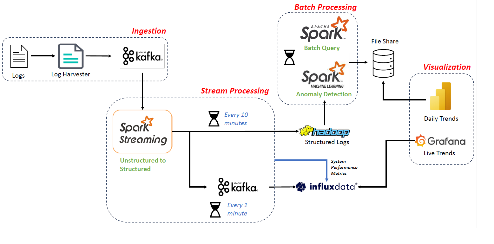

# Operational Analytics - A Log driven dashboard for HDFS

This repository contains source code for the project ***Operational Analytics - A Log driven dashboard***.

We have created an end-to-end pipeline shown above designed to ingest, process, and visualize log data. The system can transform unstructured log data into a structured format, detecting anomalies in system performance, and providing real-time and historical insights through visualizations. This design employs multiple data processing frameworks and technologies such as Apache Kafka, Apache Spark, Hadoop, InfluxDB, PowerBI and Grafana, offering both batch and stream processing capabilities to ensure robust data analysis and monitoring. It combines stream and batch processing using Apache Kafka and Apache Spark, allowing for real-time and batch-level data transformation and analysis. The use of InfluxDB and Grafana for visualization ensures that insights into system performance are readily available, both for immediate action (live trends) and long-term analysis (daily trends). By using these technologies, the system can offer prompt and actionable insights, improving the ability to monitor and optimize system performance. 

## Contributors
- Abhitosh
- Amit Nitin Joshi
- Naik Raghavendra Narottam
- Vignesh S